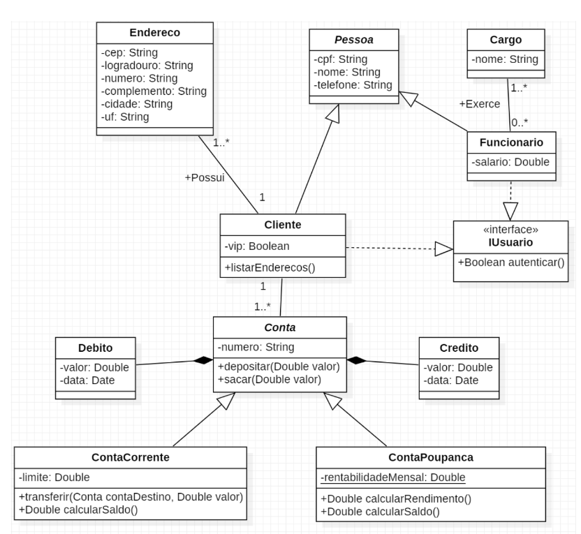

# IUUL - Desafio 3

O objetivo desse projeto foi a realização do primeiro desafio da residência em desenvolvimento de software da [iUUL](https://iuul.com.br/). O projeto foi a resolução de um desafio com objetivo exercitar conceitos de orientação a objetos na prática utilizando typescript.

## Desenvolvimento de aplicação Orientada a Objetos utilizando Typescript

O diagrama de classes utilizadas para esse projeto foi.



### Requisitos

- [x] 1. **Criação das Classes Abstratas:** as Classes Conta e Pessoa são classes abstratas, isto é,
     não podem instanciar objetos, mas somente auxiliar na definição de outras classes.
- [x] 2. **Criação da interface IUsuario:** a interface IUsuario possui apenas a assinatura de um
     método. Esse método, quando implementado nas classes que realizam a interface, deve
     retornar apenas True.
- [x] 3. **Criação das Classes Concretas:** as classes concretas são todas as demais classes. Repare
     que algumas delas possuem relacionamento de herança com as classes abstratas existentes
     no modelo.

  - [x] a. **Método listarEnderecos() da classe Cliente:** o método deve imprimir no console
        todos os endereços armazenados para um cliente.
  - [x] b. **Método depositar() da classe Conta:** cria um objeto do tipo Credito vinculado à
        conta que está recebendo o depósito.
  - [x] c. **Método sacar() da classe Conta:** cria um objeto do tipo Debito vinculado à conta
        que está sofrendo o saque. (conta não pode ter saldo negativo além do seu limite).
  - [x] d. **Método transferir() da classe ContaCorrente:** retira dinheiro da conta corrente de
        origem e envia para uma conta destino. (a conta não pode ter saldo negativo além
        do seu limite).
  - [ ] e. **Método calcularRendimento() da ContaPoupanca:** << Defina sua regra para
        cálculo de rendimento da conta poupança >>
  - [ ] f. **Método calcularSaldo() da ContaPoupanca:** soma o valor de todos os créditos e
        subtrai pela soma dos valores de todos os débitos. Além disso, soma o rendimento
        ao valor final.
  - [x] g. **Método calcularSaldo() da ContaCorrente:** soma o valor de todos os créditos e

    subtrai pela soma dos valores de todos os débitos. Após, soma o valor do limite. Ao
    final, retorna o valor.

- [x] 4. **Criação dos Relacionamento entre Classes:** as linhas que ligam as classes são chamadas
     de associação. A existência de uma associação entre a Classe A e a Classe B significa, em
     programação, que existirá um atributo da Classe B na definição da Classe A e vice-versa (a
     depender da navegabilidade atribuída no modelo → direção da seta). As cardinalidades
     (números presentes nas associações) dizem respeito a quantos objetos da Classe B podem
     existir se ligando com um objeto da classe A (e vice-versa). Esses números vão auxiliar na
     definição da estrutura de dados a ser utilizada para representar o atributo de uma determinada
     classe.
- [ ] 5. **Criação de Objetos:**
  - [ ] Aplicação 1
    - [ ] Crie dois funcionários do banco, um gerente e um atendente.
  - [ ] Aplicação 2
    - [ ] Crie um cliente e adicione 3 endereços a ele
    - [ ] Imprima os endereços desse cliente
  - [ ] Aplicação 3
    - [ ] Crie um cliente que possua uma ContaCorrente
    - [ ] Efetue três depósitos de 100 nessa ContaCorrente
    - [ ] Efetue um saque de 50 reais nessa ContaCorrente
    - [ ] Imprima o valor do saldo dessa ContaCorrente
  - [ ] Aplicação 4
    - [ ] Crie um cliente que possua uma ContaCorrente
    - [ ] Efetue um depósito de 1000 nessa ContaCorrente
    - [ ] Crie um cliente que possua uma ContaPoupanca
    - [ ] Efetue um depósito de 1000 reais nessa conta Poupanca
    - [ ] Efetue uma transferência de 500 reais da ContaCorrente para ContaPoupanca
  - [ ] Aplicação 5
    - [ ] Crie um cliente que possua uma ContaPoupanca
    - [ ] Defina a rentabilidadeMensal em 1%
    - [ ] Efetue 1 depósito por mês de 200 reais do dia 01/01/2022 até 31/12/2022
    - [ ] Efetue um saque de 100 reais no dia 05/03/2022
    - [ ] Efetue um saque de 200 reais no dia 08/07/2022
    - [ ] Calcule o saldo da conta poupança considerando os rendimentos

## Tecnologias utilizadas

- Typescript.

## Como testar o projeto

Para testar o projeto é necessário possuir o [Node.js](https://nodejs.org/en/) instalado, junstamente com o [npm](https://www.npmjs.com/).

```bash
#Clonar o projeto e installar as dependências
git clone https://github.com/guilhermag/iuul-desafio3.git

cd iuul-desafio3/

npm install

# Iniciar o servidor de desenvolvimento
npm run start:dev

# Caso queira gerar os arquivos javascript
npm run build
```

**_O comando de build pode gerar erros no Windows, por causa do rimraf, usuários de Windows deverão deletar a pasta /build manualmente (caso ela ja exista) e rodar o comando novamente._**

## Créditos

Desenvolvido por Guilherme de Araujo Gabriel.
